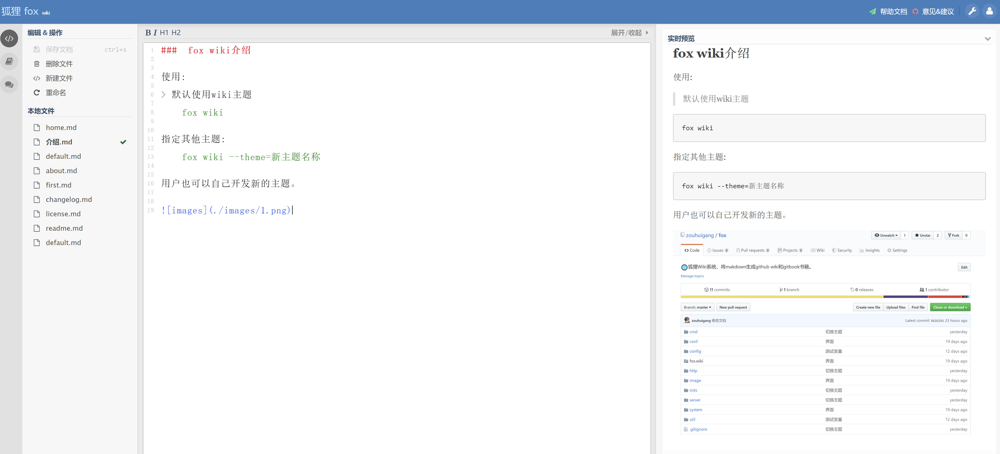

### fox wiki

### 1.下载安装

### 2.使用

	git clone https://github.com/zouhuigang/fox.wiki.git

### 3.当前命令行打开,运行

	fox wiki

---

### 安装皮肤

# 创建 themes 目录

	$ cd fox.theme
	$ git clone https://github.com/zouhuigang/wiki.git

# 运行主题

	fox wiki --theme=wiki

